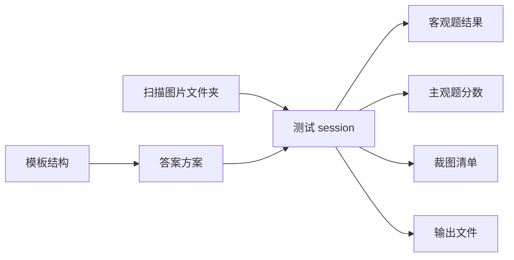
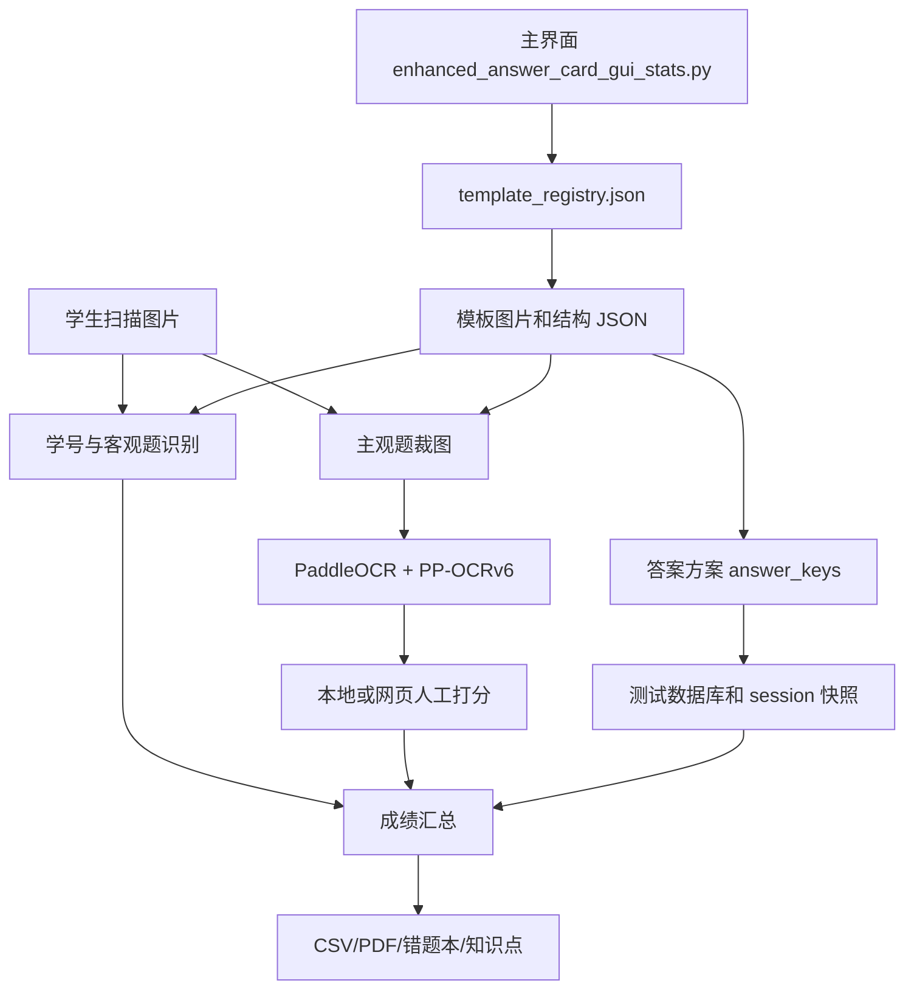

# 答题卡与试卷批改系统：当前版使用与维护手册

> 文档状态：当前维护入口  
> 最后核对：2026-09-16  
> 版本演进与更新日志：[软件更新日志.md](软件更新日志.md)  
> 项目目录：`C:\Users\Administrator\.openclaw\workspace\answer_card_autograder`

这份文档同时面向日常使用和后续维护。以后新增功能、改变数据格式或调整关键流程，应优先更新本文件及 [软件更新日志.md](软件更新日志.md)。旧的实验记录和早期说明仍保留，但不应当作为当前程序的唯一依据。

## 1. 一分钟快速使用

推荐从桌面快捷方式启动：

```text
C:\Users\Administrator\Desktop\答题统计系统_修复版.lnk
```

快捷方式最终启动：

```text
C:\Users\Administrator\.openclaw\workspace\answer_card_autograder\启动答题统计系统.bat
```

主程序：

```text
enhanced_answer_card_gui_stats.py
```

当前 Python：

```text
C:\Users\Administrator\AppData\Local\Programs\Python\Python314\python.exe
```

日常批改的推荐顺序：

1. 选择正确模板。
2. 选择学生图片文件夹，或打开已经创建的测试。
3. 加载或设置整套答案方案。
4. 检查试卷结构和裁图预览。
5. 开始客观题批改。
6. 一键 OCR 自动判分。
7. 本地或网页完成需要人工处理的题。
8. 查看整卡标注和统计结果。
9. 导出 CSV、PDF、错题本或知识点分析数据。

## 2. 当前模板

模板注册表：`template_registry.json`。

| 模板 key | 界面名称 | 主要用途 |
| --- | --- | --- |
| `direct_paper_choice_v1` | 试卷直接批改模板-v1 | 直接识别试卷选项小方框和主观题横线，支持正反面 |
| `mixed_objective_subjective_v1` | 客观主观混合模板-v1 | 传统答题卡式客观题、填空、实验、作图和计算题 |
| `mixed_objective_subjective_v2_edge` | 客观主观混合模板-v2（边缘定位块） | 混合模板新版，定位块和版面与 v1 分开保存 |
| `错题采集模板_tc` | 错题采集模板-tc | 采集学生错题，生成分析数据和错题本 |
| `default` | 默认阅卷模板 | 早期兼容项和兜底项，不建议直接删除 |

切换模板前请保存当前工作。打开新的试卷文件夹时，程序不会自动沿用上一个测试的答案、主观题结构或未匹配的班级名册；请明确加载该试卷的方案。已有测试使用自己的快照；同一文件夹绑定多个测试时，需从“打开测试”明确选择。

2026-09-16 数据隔离与透打修复说明见《数据隔离排查与修复_20260916.md》。

## 3. 试卷直接批改模板

这是当前变化最多、也最需要结构预览的模板。

### 3.1 设置正反面结构

入口：

```text
设置 -> 设置正反面结构（小框+横线）
```

或者主界面的：

```text
正反面结构
```

设置过程：

1. 选择正面或背面。
2. 选择该面的空白试卷模板图。
3. 程序同时识别选择题小方框和主观题横线。
4. 在预览图中点击误抓的小方框或横线，可删除或恢复。
5. 检查选择题题号与 A、B、C、D 的对应关系。
6. 如某根横线用于作图题，将该空标记为“作图”。
7. 保存本页结构。
8. 再设置另一面。

横线编号采用阅读顺序：先从上到下，再处理同一行；同一行必须从左到右编号。

### 3.2 作图题规则

作图题仍占一个主观题位置，但不走 OCR：

- 普通填空默认每空 1 分。
- 作图题默认满分 2 分。
- 作图题人工可打 0、1、2 分。
- 设置结构时只标记“这个空是作图”，真实题号由答案输入中的题号继续对应。
- 设置答案时保留该题，答案可填写“作图”作为占位。

作图裁图不是只裁横线本身，而是以横线为底边向上扩展，包含完整作图区域。因此必须查看“实际裁图范围”，不能只看横线有没有抓准。

### 3.3 查看已经保存的结构和裁图

入口：

```text
主界面 -> 查看裁图
```

或者：

```text
设置 -> 查看已保存结构/裁图
```

窗口内容：

- 正面和背面分别显示。
- “整页范围”显示所有实际裁图框。
- “逐项裁图”显示程序真正会送给 OCR 或人工打分的图片。
- 蓝框表示选择题小方框。
- 红框表示普通主观题实际裁图。
- 橙框表示作图题实际裁图。

结构保存完成后，新版程序会自动打开一次预览。主界面的“查看裁图”可以随时再次打开。

这个窗口显示的是“当前加载答案方案”保存的结构，不按日期限制。要看以前的方案，应先加载相应答案方案。很早期的方案如果没有保存模板图和结构，则无法预览。

### 3.4 正反面图片顺序

双面扫描通常按以下方式配对：

```text
0.1.jpg = 第1名学生正面
0.2.jpg = 第1名学生背面
0.3.jpg = 第2名学生正面
0.4.jpg = 第2名学生背面
```

单数图片是正面，紧随其后的双数图片是同一学生背面。背面旋转原则尽量跟随正面，不依赖背面残缺定位块单独判断方向。

如果本次只有单面，必须使用相应单面模式或只选正面文件，避免把下一名学生的正面当成上一名学生的背面。

## 4. 客观主观混合模板

混合模板主要包含：

- 学号区。
- 选择题填涂区。
- 填空题。
- 实验题。
- 作图题。
- 可选计算题背面。

推荐流程：

1. 选择 v1 或 v2，不能混用结构。
2. 选择文件夹或打开测试。
3. 加载整套答案方案。
4. 实验题结构变化时，先设置实验题结构。
5. 检查 OCR 空位设置。
6. 开始批改和 OCR。
7. 人工完成作图题、计算题和 OCR 无法确定的题。

v1 与 v2 的模板图、定位块、学号区和结构文件分别保存。加载方案时必须检查模板 key 是否一致。

## 5. 一体化答案方案

答案方案不是一张简单答案表，而是一整套批改配置。

当前答案方案应包括：

- 模板 key 和模板名称。
- 客观题标准答案。
- 主观题题号和标准答案。
- 多个可接受答案。
- 关键词。
- 常见错答案。
- 错误关键词。
- 前诱导字和后诱导字。
- OCR 开关与置信度。
- 主观题/实验题结构。
- 试卷直接批改模板的正反面结构和模板图片。
- 本套试卷的知识点清单。

答案方案目录：

```text
answer_keys\
```

方案模板图片目录：

```text
answer_keys\_scheme_assets\
```

关键原则：

- 设置文件夹和加载答案方案是两个独立动作。
- 选择文件夹不能清空或替换答案。
- 加载答案不能偷偷改变到无关试卷结构。
- “清空当前配置”只清空编辑窗口，不删除已保存方案。
- 修改 OCR 空位设置后，应同步回当前答案方案。
- 删除方案只删除明确选中的旧方案。

### 5.1 答案粘贴格式

选择题可使用：

```text
1.B
2.D
3.A
11.BD
12.AC
```

也支持紧凑分隔格式：

```text
1,D;2,D;3,C;4,A;11,BD;12,AD
```

主观题建议：

```text
13.电磁波；3×10^8
20.(1)不漏气；相等 (2)有关；宽
21.(1)碎冰；-6；固态
```

规则：

- 题号和小题号用于定位，不能作为答案填入空位。
- 同一题多个空使用中文或英文分号分隔最清楚。
- 解析完成后必须核对“答案数量”和“结构空位数量”。
- 答案不足或多余时应提示，不应静默错位填入。
- 作图题填写“作图”作为占位。

## 6. 文件夹、测试和进度的关系

这三个概念不能混为一谈：

- 文件夹：学生扫描图片和输出文件所在位置。
- 测试：数据库中的一次正式批改记录，有唯一 `session_id`。
- 答案方案：可复用的标准答案、结构和 OCR 配置。

推荐关系：



打开已有测试时，应恢复：

- 对应图片文件夹。
- 当前模板。
- 测试绑定的答案快照。
- 测试绑定的结构快照。
- 客观题结果。
- 主观题 OCR 和人工打分进度。

打开文件夹时，如果程序找到该文件夹已绑定测试，应自动加载测试进度；如果没有，应立即自动创建测试，不允许先产生未绑定的批改进度。

新文件夹自动创建测试时保留当前答案和试卷结构，便于同卷多班连续批改，并把它们复制为新测试自己的快照。只清空上一个班的学生结果；打开已有测试则始终恢复该测试自己的答案和结构。

批改、OCR、网页上传和数据库保存前还会校验“当前文件夹=测试绑定文件夹”。不一致时必须停止，不能通过保存动作把原测试改绑到另一个班。

开始批改前按“测试名称末段包含答案方案名称（或反向包含）”核对试卷身份，例如 `24-1\\1-3章` 与 `1-3章` 匹配；不匹配时必须由用户确认后才能继续。

## 7. 主观题裁图、OCR 和人工打分

### 7.1 裁图

主观题结构来源于 `subjective_config.json` 或答案方案中的主观题配置。

每次裁图会生成 `_crop_manifest.json`，用于判断旧裁图是否仍可复用。结构、模板图、方向或裁图坐标变化后，清单签名应变化并重新裁图；只修改分数时不应重新裁图。

学生文件夹常见输出：

```text
主观题裁图\current\
```

### 7.2 当前 OCR 流程

当前主流程不再使用 DotsOCR 作为常规兜底：

1. 第一轮使用 PaddleOCR 的快速配置。
2. 命中标准答案，直接给分。
3. 命中常见错答案或错误关键词，直接判 0 分。
4. 第一轮结果不确定时，使用 PP-OCRv6 配置复核。
5. 第二轮命中标准答案，给分。
6. 第二轮仍不一致、两次均未识别或存在涂改时，进入人工打分。
7. 标记为手改或作图的题直接进入人工。

当前默认低置信度阈值为 0.6；每个空可以单独设置。

标准答案支持：

- 多个同义答案。
- 关键词命中。
- 常见错答案。
- 错误关键词。
- 科学计数法和普通数字的等价归一化。
- 前后诱导字。

### 7.3 人工打分

人工打分应只显示需要人工处理的题。浏览模式中如果发现机器或人工分数错误，切到该空后直接点击新分数即可修改并立即保存，不应强制重新 OCR 或重新裁图。

导航原则：

- 人工模式的上一空/下一空只在人工任务之间移动。
- 不应跳回已经自动判分且无需复查的空。
- 打完所有人工题后应弹窗提醒。
- 修改分数后主界面统计应立即刷新。

### 7.4 网页人工批改

网页人工批改入口：

```text
https://your-domain.com
```

本地主程序支持：

- 一键 OCR 并上传人工项。
- 单独上传网页人工打分任务。
- 获取网页打分。
- 删除网页任务。

网页只应上传需要人工处理的裁图，不上传已经可靠自动判分的全部题目。下载完成后，本地回写分数并删除 VPS 上对应任务，避免长期占用空间。

服务端程序：`manual_grading_web_server.py`。  
本地连接配置：`manual_web_sync_config.json`。  
登录密码和服务器敏感信息不要写入本说明文件。

## 8. 客观题、主观题和总分

客观题按题号记录学生答案、标准答案、得分和满分。

主观题按稳定的 `part_id` 保存，例如：

```text
qB013_b1
qB010_drawing_10
```

分数恢复必须同时核对：

- `session_id`。
- 模板 key。
- 答案方案。
- 主观题结构签名。
- 图片路径或学生条目 key。
- `part_id`。

不能只根据“第几个空”恢复旧分数，否则结构插入、删除或改作图题后容易串分。

直接批改模板当前基本规则：普通空 1 分、作图 2 分。混合模板按其答案方案和结构中保存的分值执行。

## 9. 整卡标注和透打 PDF

整卡标注预览用于检查每名学生整张试卷的批改痕迹。

当前原则：

- 客观题做错时，圈出正确选项。
- 多选漏选或错选时，也直接圈出完整正确选项。
- 主观题错题保留红色批改线和对应答案提示。
- 作图题显示小题得分和作图总分。
- 试卷直接批改模板顶部只保留一个总分。
- 打印字体优先，不再依赖教师手写体作为默认数字字体。

透打 PDF 与整卡标注预览应使用同一套标注坐标逻辑，但打印机机械偏移、缩放、正反面进纸方向仍可能造成实际纸面偏差。透打校准预设保存在：

```text
overlay_calibration_presets.json
```

校准预设可以命名保存；不同打印机、不同纸张批次和正反面应分别保存。

## 10. 导出和下游分析

主要输出：

| 功能 | 用途 |
| --- | --- |
| 导出 CSV | 简洁成绩或错题数据 |
| 导出详细结果 | 给 AI 分析学生每题表现，不包含无用 OCR 调试信息 |
| 导出到题库系统 | 每题一行，保留学生编号、姓名、题号、得分、满分 |
| 整卡标注预览/PDF | 查看学生整卷批改情况 |
| 透打标注 PDF | 打印红色标注到纸质试卷 |
| 主观题裁图 | 调试、人工打分或网页任务 |
| 错题本 Word | 学生错题本或班级总体错题本 |

题库系统导出当前保留列：

```text
学生编号,姓名,题号,得分,满分
```

要求：

- 按题输出，不按空位输出。
- 学号保留前导零，例如 `0001` 不能变成 `1`。
- 同一题多个空或多个小题应合并成一道题的总得分和总满分。

## 11. 错题本

错题本支持混合模板和错题采集模板。

主要方式：

- 生成单个学生错题本。
- 批量生成学生错题本。
- 合并学生历次错题。
- 生成班级总体错题本。
- 按错误人数阈值筛选班级高频错题。

拆题原则：小题不能脱离大题题干。例如 `25(2)` 出错时，应提取完整第 25 题，而不是只提取 `(2)`。

Word 试卷建议放在当前选择文件夹或其明确绑定目录。避免程序从上一级目录误读另一份旧 Word 试卷。

## 12. 知识点数据

本套试卷的知识点“身份证”应在一体化答案方案中手动导入，并与答案方案一起保存。

CSV 至少包含：

```text
题号,知识点编号
```

可以继续带入：

- 知识点名称。
- 难度。
- 权重或重点程度。
- 以后扩展的一题多知识点关系。

当前目标：

- 按学生查看长期知识点薄弱项。
- 按时间段或测试范围统计。
- 在“工具 -> 学生知识点分析”中切换“班级总体/学生个人”，按班级查看共同缺陷或追踪个人薄弱项。
- 以后形成“声、光、热、力、电 -> 章 -> 知识点”的逐级雷达图。

知识点关系必须按题号绑定，不能按 CSV 行号绑定。

## 13. 班级和名册

班级管理支持：

- 创建班级。
- 删除班级。
- 添加学生。
- 删除学生。
- 保存学生编号和姓名。

本地名册辅助文件：`student_roster_local.py`。

程序应优先使用当前电脑和项目目录中的名册，不再依赖旧电脑的用户名或硬编码路径。

## 14. 关键文件和目录

| 路径 | 作用 |
| --- | --- |
| `enhanced_answer_card_gui_stats.py` | 主 GUI 和主要业务逻辑 |
| `template_registry.json` | 模板注册表 |
| `templates\` | 各模板的图片和 JSON 配置 |
| `answer_keys\` | 可复用答案方案 |
| `answer_keys\_scheme_assets\` | 答案方案绑定的模板图片 |
| `answer_card_app.db` | 测试、学生结果等数据库 |
| `session_answer_keys\` | 每次测试绑定的答案快照 |
| `session_template_configs\` | 每次测试绑定的结构快照 |
| `session_subjective_scores\` | OCR 和人工主观题分数 |
| `ocr_preference_memory.json` | 答案、错答案、诱导字等偏好记忆 |
| `manual_web_packages\` | 网页人工批改上传包 |
| `manual_web_sync_config.json` | 本地与网页服务连接配置 |
| `manual_grading_web_server.py` | VPS 网页人工批改服务 |
| `paddle_ocr_helper.py` | PaddleOCR/PP-OCRv6 子进程接口 |
| `wrongbook_generator.py` | Word 错题本生成 |
| `marker_utils.py` | 定位块和单应性变换 |
| `marker_detector.py` | 定位块和方向检测 |
| `student_roster_local.py` | 本地班级名册 |
| `teacher_mark_assets\` | 已录入的教师笔迹素材，当前不作为默认数字字体 |
| `enhanced_gui_settings.json` | 当前界面设置和上次加载状态 |

项目根目录内的同名子目录、`archive_*`、`answer_card_project_backup_*` 和大量调试图片主要是历史资料，不是当前启动入口。

## 15. 代码模块连接关系



关键内部入口：

| 功能 | 主要函数 |
| --- | --- |
| 选择文件夹 | `select_folder` |
| 创建/打开测试 | `create_session_record`, `open_session_browser` |
| 一体化答案方案 | `set_answer_key` |
| 班级管理 | `open_class_manager` |
| 设置正反面结构 | `open_direct_paper_structure_setup` |
| 查看结构和裁图 | `open_saved_direct_paper_structure_preview` |
| 主观题裁图 | `generate_subjective_crops` |
| OCR 自动判分 | `run_paddle_ocr_for_crops` 及主观题批改流程 |
| 主观题人工打分 | `open_subjective_grading` |
| 计算题人工打分 | `open_calculation_score_entry` |
| 网页 OCR/人工任务 | `auto_ocr_and_upload_manual_web_tasks` |
| 整卡标注 | `open_marked_card_browser` |
| 透打 PDF | `export_marked_card_overlay_pdf` |
| 错题本 | `open_wrongbook_tool`, `wrongbook_generator.py` |
| 知识点分析 | `open_knowledge_analysis` |
| 题库导出 | `export_question_bank_csv` |

## 16. 维护时必须遵守的状态边界

这个项目最容易出错的不是单个识别算法，而是不同状态被错误覆盖。

必须保持以下边界：

1. 选择文件夹不能清空答案方案。
2. 加载答案不能修改到无关试卷结构。
3. 设置结构后必须同步答案空位数量，但不能静默移动已有答案。
4. 修改分数不能触发重新裁图。
5. 修改结构后必须更新裁图签名并重新裁图。
6. 打开测试必须优先读取测试快照，不能自动套用名称相似的其他方案。
7. 打开文件夹时只能自动匹配真正绑定该文件夹的测试。
8. 网页下载分数必须按稳定任务 ID 和 `part_id` 回写。
9. 同一题多个空在导出时要按题聚合，不能误当成多道题。
10. 旧路径、旧用户名和旧电脑目录不能作为唯一依赖。

一句话原则：**答案、模板、测试和进度可以绑定，但不能互相偷偷覆盖。**

## 17. 常见故障

### 程序打不开

检查：

- 是否使用正确桌面快捷方式。
- Python 3.14 路径是否存在。
- 控制台是否提示缺少模块。
- 项目目录和启动脚本是否完整。

### 方案加载后答案未设置

检查：

- 当前模板 key 是否与方案一致。
- 方案 JSON 是否包含 `answer_key` 和 `subjective_config`。
- 是否被当前测试的旧答案快照覆盖。
- 主观题 `part_id` 和结构是否一致。

### 裁图看着不对

先点“查看裁图”：

- 如果整页橙框/红框已经错，说明保存结构有误。
- 如果模板预览正确但学生裁图错，检查定位、方向和单应性变换。
- 如果结构已经修改但仍显示旧图，检查 `_crop_manifest.json` 是否被错误复用。
- 作图题必须看向上扩展后的完整橙框，不能只看横线。

### 同一份试卷有时识别正常、有时异常

检查：

- 是否加载了同一答案方案和同一模板结构。
- 正反面是否配对正确。
- 扫描方向和分辨率是否一致。
- 是否误套测试快照。
- 模板图是否被另一套方案覆盖。

### 主观题进度丢失

检查：

- 当前测试是否有 `session_id`。
- `session_subjective_scores\<session_id>.json` 是否存在。
- 当前结构签名是否变化。
- 是否打开了同名但不同 ID 的测试。

### PDF 分数与界面不一致

先确认只打开一个主程序窗口，再检查：

- 当前结果是否刚刚刷新。
- 主观题人工分数是否已经保存。
- PDF 是否使用旧结果缓存。
- 是否打开了上一次导出的旧 PDF。

## 18. 修改代码后的最低验证清单

每次较大修改至少验证：

1. `python -m py_compile enhanced_answer_card_gui_stats.py` 通过。
2. 桌面快捷方式能启动。
3. 当前模板能加载。
4. 文件夹与测试能正确互相恢复。
5. 答案方案能恢复客观题、主观题和结构。
6. 学号识别正常。
7. 客观题识别正常。
8. 正反面结构预览和逐项裁图正常。
9. OCR 第一轮和 PP-OCRv6 复核正常。
10. 人工分数可修改、保存和恢复。
11. 整卡标注和 PDF 分数一致。
12. 题库 CSV 按题输出且学号保留前导零。
13. 错题本能生成。
14. 关闭窗口不会丢失进度。

测试时优先使用已有真实样本文件夹，不要只用人工构造数据。

## 19. 备份和恢复建议

修改以下内容前先备份：

- `enhanced_answer_card_gui_stats.py`
- `answer_card_app.db`
- `answer_keys\`
- `templates\`
- `session_answer_keys\`
- `session_template_configs\`
- `session_subjective_scores\`
- `manual_web_server_config.json`

不要直接删除旧方案或快照。优先重命名或复制到 `backups\`，确认新版本稳定后再整理。

## 20. 当前已知限制

- 主程序文件很大，功能集中，修改一个流程可能影响其他模板。
- 很早期答案方案可能没有保存完整模板结构，无法直接裁图预览。
- 直批模式的横线自动识别仍需要人工删除误抓项。
- OCR 对涂改、字迹极小、公式和复杂手写仍可能需要人工。
- 打印机机械偏移不能完全靠软件校准消除。
- 当前“查看裁图”只查看当前加载方案，窗口内暂时没有全部方案下拉选择。
- 知识点长期分析处于第一阶段，一题多知识点和完整多级雷达图仍可继续扩展。

## 21. 后续建议

推荐按以下顺序继续维护：

1. 保证测试、方案、结构和分数不串数据。
2. 为关键状态加载和保存增加自动回归测试。
3. 逐步把主程序拆分为模板、会话、OCR、人工打分、导出等模块。
4. 完善知识点长期分析和雷达图。
5. 最后再继续优化 OCR 和打印校准。

稳定的数据绑定比提高少量识别率更重要。

## 22. 2026-09-14 运行可靠性维护

本次修改与验证见 [项目运行风险检查与优化记录](项目运行风险检查与优化记录_20260914.md)，版本摘要见 [软件更新日志](软件更新日志.md) v2.7.4。

- 重新打开历史测试时，以测试答案快照为准；需要采用更新后的公共答案方案，应手动加载该方案并保存。
- 当前成绩文件损坏、测试 ID 或模板不一致时，程序报错并保留文件，避免用空成绩继续覆盖。请从备份恢复或核对测试绑定。
- 本地保存先检查测试与文件夹，再写成绩和快照；JSON 文件采用原子替换。
- 网页打分必须收到服务器成功响应才显示保存成功并进入下一空。失败时重试；取分失败时远端任务保留。
- 网页满分由已上传任务决定，本地回写以当前题目满分为准。修改结构后应重新检查任务对应关系。
- 模型异常响应不会作为成功 0 分；真实有效 0 分正常保存。已有私密模型配置继续使用，也可通过 `ANSWER_CARD_LLM_API_KEY` 指定密钥。
- 本地代码修改需要重启桌面程序；网页改动需要更新 VPS 上的服务端脚本后生效，本次未部署线上服务。

回归命令（在包根目录）：`py -3.14 -m unittest discover -s app/tests -v`。本次 34 项通过，但不替代真实扫描、OCR、全部模板界面和 PDF 打印验收。

