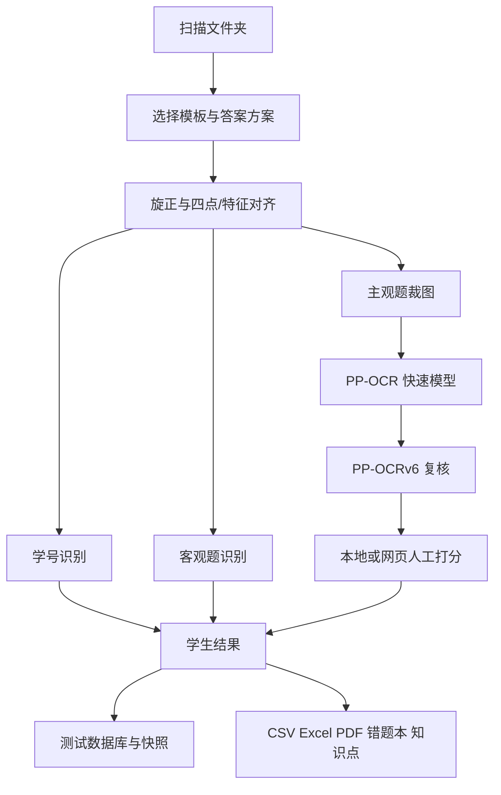

# 答题批改系统项目维护与备份说明

> 文档版本：2026-09-02  
> 当前源码目录：`C:\Users\Administrator\.openclaw\workspace\answer_card_autograder`  
> 当前稳定启动目录：`C:\Users\Administrator\Documents\Codex\2026-04-27\py-c-c-users-17013-openclaw`

本文面向以后继续维护程序的人。日常使用请看 `主程序使用帮助.md`。

## 1. 当前系统边界

系统已经不是单一 OMR 工具，而是以下模块组成的本地批改平台：

- 模板注册和正反面结构识别。
- 四点定位、页面旋正和模板对齐。
- 学号和客观题识别。
- 主观题裁图、两阶段 PaddleOCR 和人工打分。
- 本地测试、答案、模板和打分进度持久化。
- VPS 网页人工批改同步。
- 整卡标注、透打 PDF、成绩和题库数据导出。
- Word 错题本和班级高频错题。
- 学生/班级知识点缺陷分析与题库桥接。
- 班级名册管理及从扫描答题卡批量提取姓名、学号。
- 老师讲评透打 PDF 和学生错题知识点标注。

主程序仍是一个大型 Tkinter 文件，修改任何状态恢复、结构编号或分数聚合逻辑时都要做跨模板回归测试。

## 2. 启动链

当前日常启动链：

```text
桌面快捷方式
  -> 启动答题统计系统_稳定版.bat
  -> answer_card_stable_bootstrap.py
  -> enhanced_answer_card_gui_stats.py
```

稳定启动器负责：

- 指定 Python 3.14。
- 把 `pydeps314` 加入模块搜索路径。
- 防止同时启动两个主程序窗口。
- 为少数历史兼容逻辑打运行时补丁。
- 在定位失败时提供安全兜底。

维护时必须同时检查主程序和稳定启动器。只测试直接运行主程序，不能代表桌面快捷方式的实际行为。

## 3. 核心代码

| 文件 | 责任 |
| --- | --- |
| `enhanced_answer_card_gui_stats.py` | 主界面、模板、答案、批改、OCR、进度、导出和绝大多数业务逻辑 |
| `marker_detector.py` | 四角定位块和页面方向检测 |
| `marker_utils.py` | 定位块候选、单应性矩阵、坐标投影和调试图 |
| `template_registry.py` | 模板注册表读写和路径解析 |
| `template_capture_wizard.py` | 录入传统答题卡模板 |
| `paddle_ocr_helper.py` | 独立 PaddleOCR 子进程入口 |
| `wrongbook_generator.py` | Word 试卷拆题、学生错题本和班级错题本 |
| `knowledge_analysis.py` | 班级/学生知识点统计、人工录入和题库桥接 |
| `manual_grading_web_server.py` | VPS 网页人工打分服务端 |
| `extract_roster_from_cards.py` | 从扫描答题卡批量提取姓名和学号，生成待确认名册，不直接覆盖正式名册 |
| `student_roster_local.py` | 旧名册兼容加载；当前班级也保存在数据库/本地名册配置中 |

历史调试脚本、`answer_card_project_backup_*`、`archive_*`、`debug_outputs` 和根目录中的旧 GUI 不是当前运行入口。

## 4. 模板注册表

模板入口为 `template_registry.json`。每个模板至少指定：

```json
{
  "display_name": "界面名称",
  "mode": "grader",
  "template_image": "模板图",
  "marker_config": "定位块配置",
  "answer_config": "客观题结构",
  "student_id_config": "学号结构",
  "subjective_config": "主观题结构"
}
```

当前模板：

| key | 用途 |
| --- | --- |
| `direct_paper_choice_v1` | 试卷直接批改，正反面小框、横线、作图和计算题 |
| `mixed_objective_subjective_v1` | 混合答题卡 v1 |
| `mixed_objective_subjective_v2_edge` | 混合答题卡 v2 |
| `错题采集模板_tc` | 错题采集和错题本 |
| `default` | 旧版兼容项，不建议作为新功能基础 |

模板目录中真正运行需要的通常只有：

- 当前模板正反面图片。
- `template_marker_detection.json`。
- `answer_zone_points.json`。
- `student_id_points.json`。
- `subjective_config.json`。
- 直批模板的 `direct_subjective_lines.json`。

大量 `*.backup_*`、`*preview*` 和 `*debug*` 是历史记录，打包时可以排除。

## 5. 核心数据流



## 6. 定位、学号和客观题识别

### 6.1 页面方向和模板对齐

传统模板先根据异形四角定位块判断方向，再用四点计算单应性矩阵。试卷直批模板会比较多种候选：

- 通用定位块候选。
- 四角区域鲁棒黑块候选。
- 空白模板与扫描图的特征匹配候选。

程序按整页对齐质量选择最佳矩阵。质量低于结构中的最低值时必须停止，不能继续硬裁。

背面定位块不完整时，旋转方向尽量跟随正面；不要让背面单独误判方向。

### 6.2 学号

学号配置把每一位视为一个问题，把 `0~9` 视为十个候选。模板坐标经过单应性投影到学生卷，在默认半径 14 像素的邻域计算墨迹分数。

学号分数综合：有效墨迹深度、中心墨迹、墨迹面积和最大连通块。每位取十个分数中位数作为背景，再用最高相对分与第二名差距判定。默认阈值 90，最低差距 4；不可靠时输出 `?`，不硬猜。

### 6.3 试卷直批客观题

结构设置阶段只在空白模板上寻找一次小方框，保存其模板坐标和模板灰度。批改学生卷时把这些坐标投影到学生图，对比模板与学生图同一位置的变化，不应在每张学生卷重新寻找方框。

选择题跨页时以整套正反面题目结构为准。输出和计分必须按真实题号去重，不能把跨页题显示两次。

## 7. 主观题结构、裁图与稳定 ID

主观题的关键不是“第几个空”，而是稳定 `part_id`。一个空至少包含：

- `part_id`：保存和回写的稳定标识。
- `question_no`：大题号。
- `subquestion`：可选小题号。
- `side`：正面或背面。
- `template_rect` 或横线坐标。
- `score`：满分。
- `kind`：普通空、作图或计算题。
- OCR 设置。

新增、删除或重排空位时，不能仅按数组下标恢复旧分数。必须核对测试 ID、模板 key、结构签名、学生条目和 `part_id`。

裁图缓存通过 `_crop_manifest.json` 判断能否复用。模板图、结构坐标、方向、裁图策略发生变化时签名必须变化；只修改答案或分数时不应重新裁图。

## 8. OCR

当前独立环境：

```text
C:\Users\Administrator\Documents\Codex\2026-04-27\py-c-c-users-17013-openclaw\paddleocr_env
```

当前主要版本：

```text
paddleocr 3.7.0
paddlepaddle 3.2.2
paddlex 3.7.1
numpy 2.3.5
opencv-contrib-python 4.10.0.84
```

模型缓存：

```text
C:\Users\Administrator\.paddlex\official_models
```

默认第一轮使用 `PP-OCRv5_mobile`，需要复核时使用 `PP-OCRv6_medium`。DotsMOCR 不再是当前常规兜底。

主程序以独立子进程调用 `paddle_ocr_helper.py`，并清理主程序的 `PYTHONPATH/PYTHONHOME`，避免 Python 3.14 的常规依赖污染 Paddle 虚拟环境。

OCR 判分优先级：

1. 标记手改、作图或计算题：直接人工。
2. 命中任一标准答案：满分。
3. 命中常见错答案或错误关键词：0 分。
4. 未命中且有有效文字：第二模型复核。
5. 第二模型仍无法可靠判定：人工。
6. 两次都无文字时按空白给 0 分；有文字但规则无法判断时进入人工。

## 9. 答案方案

答案方案保存在 `answer_keys`，方案资产保存在 `answer_keys/_scheme_assets`。方案不是只有客观题答案，应整体保存：

- 模板 key 和名称。
- 客观答案。
- 主观题题号、答案和 OCR 设置。
- 实验/作图/计算题结构。
- 直批正反面结构和模板图片。
- 知识点身份信息。

加载方案时模板 key 必须匹配。加载答案方案可以恢复该方案的结构，但“选择文件夹”本身不能清空答案或偷换结构。

答案解析必须按题号、小题号和分隔符映射，不得简单把所有词按顺序塞入空位。答案数多于或少于结构空位时应阻止保存并给出具体差异。

## 10. 测试、数据库和进度

数据库：`answer_card_app.db`。

主要表：

```text
sessions:
  id, name, kind, template_key, template_name,
  created_at, roster_name, note, folder_path

session_results:
  id, session_id, file_name, score_id,
  student_name, payload_json, created_at
```

测试相关快照：

| 路径 | 内容 |
| --- | --- |
| `session_answer_keys` | 每次测试绑定的答案快照 |
| `session_template_configs` | 测试绑定的模板/结构快照 |
| `session_subjective_scores` | OCR、人工、作图和计算题进度 |

状态恢复优先级应以明确测试 ID 为核心。文件夹只能自动恢复真正绑定该 `folder_path` 的测试；同名不是同一个测试。

关闭主窗口和主观题窗口前调用保存流程。强制结束进程可能丢失尚未写入的当前操作。

## 11. 网页人工打分

本地配置：`manual_web_sync_config.json`。服务地址为 `https://your-manual-grading-server.example.com`，公网经 nginx 443 转发到服务端默认 18765 端口。

网页登录账号默认为 `teacher`。密码哈希及部署时的初始密码只保存在私密服务配置中，不应写入可公开的说明文件。网页首页按任务列出待批改内容；本机上传、网页打分、本机取回、VPS 删除构成完整闭环。

任务包只应包含待人工项。每个任务、学生和空位必须有稳定 ID。下载网页分数时按 ID 合并，成功后删除 VPS 任务。

`manual_web_sync_config.json` 含 API token，`manual_web_server_config.json` 含服务端密钥和密码哈希。这两个文件属于私密配置，压缩包不得公开分享。

## 12. 输出聚合

内部主观题按空保存，但成绩、题库 CSV 和知识点统计需要按“大题号”聚合。

题库输出当前列：

```text
学生编号,姓名,题号,得分,满分
```

要求：

- 每名学生每道大题一行。
- 同一道题的多个空、小题和作图分合并。
- 学号始终按字符串处理，保留前导零。
- 计算题和作图题计入正确大题。

## 13. 知识点

知识点总表由 `knowledge_analysis.py` 动态读取，优先位置：

```text
D:\题库系统_v2\exports\知识点编号对应内容.csv
```

若该位置不存在，再读取项目目录同名文件。知识点总表不是硬编码进主程序。

每套试卷的题号到知识点映射保存在答案方案中。统计必须按题号绑定，不能按 CSV 行号绑定。题库桥接地址保存在 `knowledge_bridge_settings.json`，通过 HTTP 发送，不直接写题库项目目录。

## 14. 常规运行依赖

当前系统 Python：`3.14.4`。

随当前稳定启动器加载的常规依赖目录：

```text
C:\Users\Administrator\Documents\Codex\2026-04-27\py-c-c-users-17013-openclaw\pydeps314
```

主要版本：

```text
pillow==12.2.0
opencv-python==4.13.0.92
numpy==2.4.4
pandas==3.0.2
openpyxl==3.1.5
python-docx==1.2.0
reportlab==4.5.1
```

Windows 自带的 Tkinter 和常用中文字体也被使用。透打 PDF 会优先查找 `C:\Windows\Fonts` 中的微软雅黑、黑体或 Arial 字体。

## 15. 绝对路径和迁移

当前机器仍存在两类绝对路径：

- 稳定启动器指向源码目录和 Python 目录。
- OCR 候选路径指向当前 `paddleocr_env`。

完整备份包提供相对路径启动器，常规依赖放在包内 `runtime/pydeps314`。换电脑后仍需：

1. 安装同系列 Python 3.14。
2. 解压到任意可写目录。
3. 运行包内 `启动答题批改系统.bat`。
4. 如需 OCR，在 `app/paddleocr_env` 建立 Paddle 环境，或修改主程序的 OCR 候选路径。
5. 把 Paddle 模型放到新用户目录的 `.paddlex/official_models`，或让 PaddleOCR 自动下载。

不要把虚拟环境文件夹直接视为完全便携。其解释器配置可能记录旧 Python 安装位置。

## 16. 备份范围

完整私有备份应包含：

- 核心 Python 文件。
- 当前有效模板文件。
- `template_registry.json`。
- `answer_keys` 和 `_scheme_assets`。
- `answer_card_app.db`。
- 三个 `session_*` 目录。
- `student_roster_local.py`。
- `ocr_preference_memory.json`。
- `teacher_mark_assets`。
- 界面、错题本、透打、题库桥接和网页同步配置。
- 两份当前文档。
- 稳定启动器、常规依赖和版本清单。
- `extract_roster_from_cards.py`、VPS 部署脚本和当前知识点总表的便携副本。

应排除：

- `__pycache__`。
- `ocr_temp`。
- `debug_outputs`、`debug_overlays`。
- `manual_web_packages`。
- 历史数据库备份。
- `answer_card_project_backup_*`、`archive_*`、根目录同名旧项目。
- 模板目录中的 `*.backup_*`、调试图和预览图。

完整备份包含学生姓名、成绩和服务器令牌，只能作为私有备份，不能公开发送。

## 17. 修改后的最低验证

每次代码修改至少执行：

```text
python -m py_compile enhanced_answer_card_gui_stats.py
```

涉及对应模块时再检查：

1. 稳定启动器能启动，重复启动会被阻止。
2. 四种主要模板都能切换。
3. 打开文件夹和打开测试都能恢复正确状态。
4. 答案方案能恢复客观、主观、结构、计算题和知识点。
5. 学号和选择题用真实学生扫描验证。
6. 正反面结构预览与实际裁图一致。
7. OCR 快速模型和 v6 复核都能运行。
8. 人工分数可修改、保存、关闭后恢复。
9. 网页任务上传、下载、删除闭环正常。
10. 整卡预览与两种 PDF 分数一致。
11. 题库 CSV 按题聚合且学号保留零。
12. 错题本和知识点分析能读取当前测试。
13. `0.1/0.2` 与 `0.01/0.02` 两种空白模板编号都能自动识别和跳过。
14. 老师讲评透打 PDF 使用最终分数并包含计算题、作图题统计。

## 18. 最容易引发回归的规则

1. 选择文件夹不能清空答案方案。
2. 加载答案方案不能套到错误模板。
3. 设置结构后可更新空位列表，但不能静默移动现有答案。
4. 修改答案不应清空人工分；修改分数不应触发重新裁图。
5. 修改结构必须改变裁图签名。
6. 打开测试优先读取该测试快照，不按相似名称猜。
7. 正反面配对和方向必须稳定，背面尽量跟随正面。
8. 作图和计算题属于主观题总分，但不走 OCR。
9. 跨页选择题只统计一次。
10. 所有导出必须使用最新保存的主观题结果。

一句话原则：答案、结构、测试和进度可以明确绑定，但不能互相偷偷覆盖。

## 19. 推荐的继续重构顺序

在功能稳定前不要一次性重写。以后如拆分主程序，建议顺序：

1. 先把纯数据模型和 ID/签名函数移出 GUI。
2. 再拆模板和答案方案仓库。
3. 再拆批改流水线与 OCR 服务。
4. 最后拆 Tkinter 窗口。

每拆一步都保持旧入口和数据格式兼容，并用真实测试目录回归。不要先重写界面再补状态恢复。

## 20. 2026-09-14 维护补充

本次新增 `core/persistence.py` 和 `tests/test_runtime_safety.py`；职责、风险与验证范围见 [运行风险检查与优化记录](项目运行风险检查与优化记录_20260914.md)。

- 保持现有 `session_id`、`part_id` 与 JSON/SQLite 数据格式；历史测试不再自动升级到较新公共答案文件。
- 关键 JSON 先序列化到同目录临时文件、flush/fsync 后原子替换。注意单文件原子性不等于数据库和全部快照共同提交。
- 网页服务继续保持独立单文件部署；进程内互斥锁保护共享任务目录，不适用于多个服务进程同时写同一目录。
- 备份白名单补入 `llm_grading_service.py`、`llm_grading_config.json`、更新日志、检查报告和 `tests`；原 `core` 目录必须完整复制。保留 SQLite 在线备份方式。
- 修改前源码与 MD 备份：包根目录 `scratch/code_backup_20260914_154728`。包含原源码中的历史凭据，按私有资料保存。
- 在包根目录执行 `py -3.14 -m unittest discover -s app/tests -v`，本次 34 项通过。真实 OCR、界面全流程、VPS 和打印验证仍需按第 17 节执行。
- 原始 `PACKAGE_MANIFEST_SHA256.txt` 对应修改前备份包；代码修改后校验差异是预期行为，重新打包再生成新清单，不应伪造原始清单。
